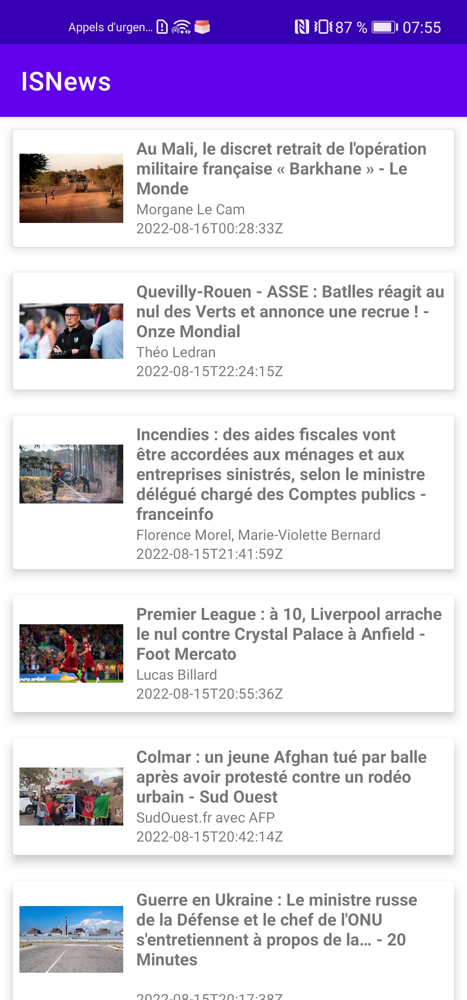
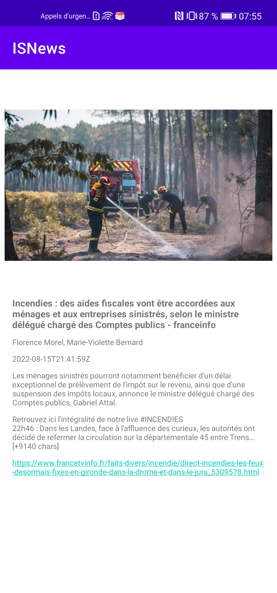

# Projet news 

Dans cette application, on a :
[x] La possibilité de voir l’ensemble des news, avec le titre de la news et l’image associée à la news.
[x] En cliquant sur une news ==> voir le détail de cette news (le titre, l’image, la description et un lien vers la news complète).
2 écrans :

Spec:
[x] Projet en Kotlin,
[x] L'architecture MVVM,
[] Pas de tests
[x] La création d'un code lisible et compréhensible de tous,
Libs :
Retrofit (pour communiquer avec l'API)
converter-gson (pour parser les données recus)
picasso (pour manipuler les images)

Les livrables :
[x] Le code source
[x] Un document (type Readme) 

Améliorations possible:
Ajout de test
Securiser l'app
Gérer les données en internes aussi (avec Room par exemple pour crée une BDD interne)
etc

Temps:
1 Jour